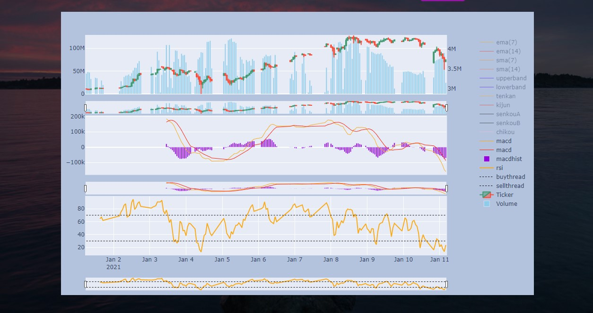

# autotrader
bitflyerのAPIを使って仮想通貨の取引をするアプリ(ラズベリーパイ用)
## 出来る事(予定)
- bitflyer 経由でのビットコイン、イーサ(ETH/JPY)の売買
- 適当なテクニカル指標を基にした自動売買(python manage.py starttrade -Ema)とかで出来る
- テクニカル指標のパラメータのバックテスト(出来る)
- テクニカル指標を取り込んだチャートの描画(出来る)
こんな感じのチャートに、テクニカル指標や売買記録をつける
  

## 使い方
1. bitflyer アカウントを取得してapikeyなどをkey.py に貼り付ける
2. 初めに以下のコマンドでラズベリーパイのアップデートや、必要なパッケージのインストールをする.  
```
sudo apt-get update
sudo apt-get upgrade
tar -zxvf ta-lib-0.4.0-src.tar.gz && \
cd ta-lib && \
./configure --prefix=/usr && \
make && \
make install && \
cd .. && \
rm -rf ta-lib-0.4.0-src.tar.gz && rm -rf ta-lib
sudo pip3 install TA-LIB
sudo pip3 install -r requirements.txt
```
3. postgresqlをインストールし、settings.pyにあるようなユーザーとデータベースを作る。 postgresqlのpostgreにログインする時に、パスワードを求めるようにしたりするのを忘れずに。
4. 以下のコマンドでsystemdにAutoTrader.service とStartStream.service が登録され、アプリが起動するので、localhost:8000にアクセスする。
```
bash sysytemdinit/makeservice.sh
```


